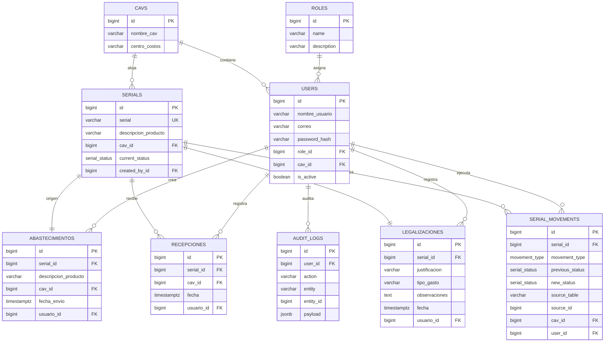

# Arquitectura MKP Serial Control

## Resumen

La solucion se construye como un monorepo con backend Flask y frontend React + TypeScript. El objetivo es mantener una arquitectura simple, desplegable y suficientemente estricta para preservar el estado del serial y su trazabilidad.

## Capas

### Backend

- `app/api/`: blueprints REST, utilidades HTTP y dependencias de autenticacion/autorizacion.
- `app/services/`: reglas de negocio, cambios de estado y auditoria.
- `app/models/`: entidades SQLAlchemy alineadas con PostgreSQL.
- `app/schemas/`: contratos Pydantic para entrada y salida.
- `app/core/`: configuracion, seguridad JWT, base de datos y enums del dominio.
- `migrations/`: migraciones Alembic para evolucionar el esquema.

### Frontend

- `src/pages/`: pantallas principales de la operacion.
- `src/components/`: layout, paneles, scanner y bloques reutilizables.
- `src/api/`: clientes HTTP por dominio para consumir el backend.
- `src/hooks/`: encapsulacion de autenticacion y estado de sesion.
- `src/store/`: persistencia local del token JWT.

## Decisiones clave

1. `serials` es la entidad maestra y concentra el estado actual.
2. `serial_movements` registra el historial completo y evita perder contexto de cambios.
3. `abastecimientos`, `recepciones` y `legalizaciones` se modelan como eventos de negocio separados.
4. JWT y RBAC viven en backend para que las reglas no dependan del frontend.
5. React Query se usa como estado principal porque la app depende de filtros, dashboards y mutaciones remotas.
6. El esquema PostgreSQL objetivo es `Schemas_Herramienta_Trade_gastos` dentro de la base `mkpsupli`.

## Flujo operativo

### Abastecimiento

1. Se valida que el serial no exista.
2. Se crea en `serials` con estado `enviado`.
3. Se registra el evento en `abastecimientos`.
4. Se agrega un movimiento en `serial_movements`.

### Recibo

1. El operador escanea uno o varios seriales.
2. Si el serial no existe, queda en `pendiente`.
3. Si existe, pasa por `recibido` y termina en `disponible`.
4. Cada paso deja huella en `serial_movements`.

### Legalizacion

1. Se busca el serial disponible.
2. Se crea la legalizacion con justificacion y tipo de gasto.
3. El serial pasa por `gastado` y luego `legalizado`.
4. Se registra auditoria operativa.

## RBAC

- `SuperAdmin`: acceso total.
- `Supernumerario`: acceso multi CAV.
- Resto de roles: restringidos a su `cav_id`.

## Modelo ER

